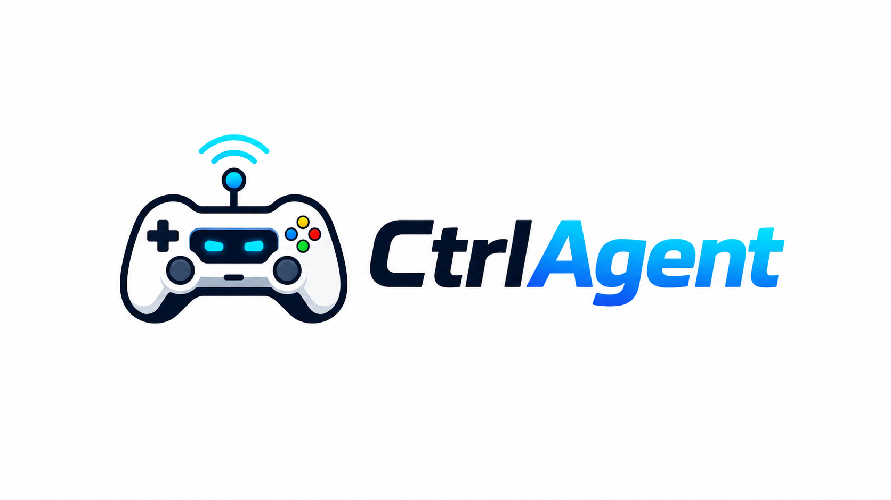

<p align="center">
  
</p>

# CtrlAgent

**CtrlAgent** is a Windows-first, open-source controller interface for AI coding agents.

It turns a game controller into a two-way agent control surface:

- Controller inputs trigger actions such as submit, interrupt, review, approve, decline, and switch session.
- Agent lifecycle events return to the controller as distinct haptic patterns.
- A local mapping engine supports normal buttons, modifier chords, gestures (tap, hold, double-press), and extra rear paddles where the hardware exposes them.

## Support matrix

Both sides of CtrlAgent are pluggable: controllers implement `IControllerDevice`, agent platforms implement `IAgentAdapter`. The goal is all popular controllers driving all popular agentic coding platforms.

**Controllers**

| Controller | Status |
|---|---|
| Xbox-family pads (XInput) | Supported — buttons, sticks, triggers, two-motor rumble |
| Xbox Elite Series 2 (GameInput bridge) | Supported over USB — adds trigger rumble. Paddles are **experimental**: hardware validation (2026-07-24) showed the PC GameInput redistributable never reports them, so fallback chords activate instead. Bluetooth uses the XInput path |
| PlayStation 5 DualSense | Implemented — raw HID (buttons, sticks, triggers, rumble, cyan lightbar, **adaptive triggers**: the pull stiffens while an approval is pending); USB and Bluetooth; hardware verification pending |
| DualSense Edge | Implemented — rear paddles/Fn map to the four paddle controls; hardware verification pending |
| Other popular pads (SDL/GameInput) | Planned |

**Agent platforms**

| Platform | Status |
|---|---|
| Mock (safe testing) | Supported |
| OpenAI Codex (app-server JSONL) | Implemented — live verification pending |
| Claude Code (stream-json) | **Verified live** — approval loop end to end against CLI 2.1.150 |
| Cursor (cursor-agent CLI) | Planned — protocol research needed |
| Google Antigravity | Planned — integration path under research |

> **Status:** pre-alpha MVP. The full software stack is implemented and unit-tested: mapping engine with gestures and profile layers, three agent adapters (Mock, Codex, Claude Code) with crash restart and session resume, three controller paths (GameInput bridge, DualSense raw HID, XInput), the Avalonia desktop app, the validation wizard, release packaging, and CI. Evidence is accumulating: the Claude Code approval loop is verified live end to end (approve and decline from controller chords), and Elite Series 2 testing produced first findings — trigger input works over USB, but the PC GameInput redistributable never reports paddles and does not enumerate Bluetooth Xbox controllers (XInput covers Bluetooth). Still to run: formal `--validate` reports, Codex live verification, and a real DualSense.

## Data flow

```text
Game controller
      |
      v
Controller adapter          -> Mapping engine -> Agent adapter
(GameInput bridge,                 |                 |
 DualSense HID, or XInput)         v                 v
      ^                     Feedback router  <- Agent events
      |                            |
Haptic scheduler <-----------------+
```

## Implemented

- .NET 10 managed host and platform-independent core, with a shared `HostEngine` hosting layer under both the console host and the GUI
- XInput controller discovery, buttons, sticks, triggers, reconnect handling, and two-motor rumble
- Native GameInput v3 bridge for four-channel rumble (Elite paddle support is experimental — the PC GameInput redistributable never reports the paddles, per hardware validation, so the bridge honestly reports no paddles and the fallback chord layer activates)
- PS5 DualSense/DualSense Edge over raw HID: USB and Bluetooth input reports, rumble, lightbar, adaptive-trigger resistance driven by the haptic patterns' trigger channels (the triggers physically stiffen while an approval waits), Edge rear paddles (protocol fully unit-tested; real-pad verification pending)
- XInput fallback approval chords when independent paddles are unavailable
- Safe mapping priority that prevents approval chords from falling through to ordinary actions
- Versioned JSON controller profiles with press, release, tap, hold, double-press, and axis-threshold gestures, capability-activated layers, collision detection, and validated approval safeguards
- Crash resilience: agent-process restart with backoff plus session resume (Codex `thread/resume`, Claude Code `--resume`), controller reconnect without restarting the host, and rumble that always stops when a device or cue goes away
- Avalonia desktop GUI: live status with pulsing indicators, a one-to-one Elite Series 2 input mirror, CTRL·BOT shortcut coaching, severity-tinted event stream with filtering, floating approval banner, prompt submission, haptic preview, tray app with overlay HUD and notification toasts, first-run setup, and a live-validating profile editor
- Prompt queueing: prompts submitted while a turn is running (typed, voice, or controller) wait and send when the agent settles, with a queue badge and transcript note
- Big Picture mode: a Steam-style fullscreen controller-first UI — navigate tiles with the d-pad or stick (A select, B back), speak prompts with offline voice dictation (Y), see every controller shortcut on one screen (X), and watch CTRL·BOT relay the agent's responses; approval paddles/chords stay live the whole time
- Guided hardware validation wizard (`--validate`) that generates the per-transport evidence reports
- Cancellable haptic scheduler and distinct working, approval, waiting, completion, and error patterns
- Mock agent adapter for end-to-end testing without a real agent
- Codex app-server JSONL adapter with thread creation, turn submission, interruption, lifecycle events, approval responses, D-pad thread switching, and thread resume after a crash
- Claude Code stream-json adapter with prompt turns, interrupt, controller-answered tool-permission prompts, and multi-session switching/crash recovery via `--resume`
- Dependency-free automated test harness
- Windows GitHub Actions builds for managed and native components, and tag-triggered self-contained release packaging

## Default controller mappings

| Input | Action |
|---|---|
| A | Submit the configured default prompt |
| B | Interrupt the active turn |
| X | Ask the agent to review changes |
| Menu | Create a new session |
| D-pad left/right | Previous/next session |
| LB + A | Run tests and fix failures |
| Rear paddles (where available) | Approve once / approve for session / decline / cancel |
| RB + A/Y/X/B | Fallback chords for the four approval actions |

Approval inputs do nothing unless an approval request is actually pending.

## Custom profiles

Mappings are configurable through versioned JSON profiles:

```powershell
dotnet run --project src/CtrlAgent.App/CtrlAgent.App.csproj -- --export-profile my-profile.json
dotnet run --project src/CtrlAgent.App/CtrlAgent.App.csproj -- --agent mock --profile my-profile.json
```

Each binding names a control, a gesture, and a command:

```json
{
  "version": 1,
  "name": "my-profile",
  "bindings": [
    { "control": "a", "gesture": "press", "command": "submitPrompt" },
    { "control": "x", "gesture": "doublePress", "command": "reviewChanges" },
    {
      "control": "paddleLeft1",
      "gesture": "hold",
      "holdMilliseconds": 400,
      "command": "approveOnce",
      "requiresPendingApproval": true
    }
  ]
}
```

Supported gestures: `press`, `release`, `tap`, `hold`, `doublePress`, and `axisThreshold` (with `minimumValue`). `modifiers` turns a binding into a chord, and `text` overrides the prompt for `submitPrompt`. Optional `layers` let one profile adapt to hardware — a `requiresPaddles` layer only activates on paddle-equipped controllers, a `withoutPaddles` layer only without them (see [the profile reference](docs/profiles.md)).

Profiles are validated before they load. Ambiguous combinations (for example `press` and `hold` on the same chord) are rejected, `approveOnce`/`approveForSession`/`decline` bindings must set `requiresPendingApproval`, and approvals must sit on a paddle, a chord, or a hold gesture so a single accidental face-button press can never approve anything.

## Install on Windows

No .NET or dev tools required — releases are fully self-contained:

1. **Installer (recommended):** download `CtrlAgent-Setup-<version>.exe` from the [releases page](https://github.com/anhtdang92/haptic-agent/releases) and run it. It installs per-user (no admin prompt), adds Start Menu entries (CtrlAgent, the console host, and the hardware validation wizard), an optional desktop shortcut, and an optional start-with-Windows toggle for the tray app, plus a normal uninstaller.
2. **Portable zip:** download `CtrlAgent-<version>-win-x64.zip`, unzip anywhere, and double-click `CtrlAgent.Gui.exe`. Nothing is written outside the folder except settings in `%AppData%\CtrlAgent`.

Building from source instead? `dotnet publish src/CtrlAgent.Gui/CtrlAgent.Gui.csproj -c Release -r win-x64 --self-contained -p:PublishSingleFile=true` produces the same single-file exe.

## Requirements (building from source)

- Windows 10 19H1 or newer
- .NET 10 SDK `10.0.302` or a compatible later .NET 10 SDK
- Visual Studio C++ build tools for the optional native GameInput bridge
- Microsoft GameInput redistributable for GameInput v3 functionality
- Codex installed and authenticated when using `--agent codex`
- Claude Code installed and authenticated when using `--agent claude`

## Build and test

```powershell
dotnet restore CtrlAgent.sln
dotnet build CtrlAgent.sln --configuration Release
dotnet run --project tests/CtrlAgent.Tests/CtrlAgent.Tests.csproj --configuration Release
```

Build the native bridge from a Visual Studio developer shell:

```powershell
msbuild native/CtrlAgent.GameInputBridge/CtrlAgent.GameInputBridge.vcxproj /restore /m /p:Configuration=Release /p:Platform=x64
```

## Run the desktop GUI

An Avalonia desktop app provides live controller/agent status with pulsing indicators, a one-to-one Elite Series 2 mirror that lights up with your physical inputs (and highlights the controls that can answer a pending approval), CTRL·BOT — a robot companion that teaches the active profile's shortcuts — a floating approval banner, prompt submission (Enter submits), a haptic-pattern preview, the active bindings as chord→action rows, a severity-tinted event stream with a controller-input filter, and notification toasts (with approve/decline) when its windows are hidden:

```powershell
dotnet run --project src/CtrlAgent.Gui/CtrlAgent.Gui.csproj -- --agent mock
```

**Big Picture mode** (header button, tray menu, **F11**, or **double-press the View button** on the pad — deliberately not the Xbox button, which Steam reserves for its own Big Picture) opens with a boot animation and chime, then turns CtrlAgent into a Steam-style fullscreen controller UI: a tile rail navigated with the d-pad or left stick (A selects, B backs out), CTRL·BOT front and center relaying the agent's responses in large type, a voice-prompt overlay (press Y, speak, review the transcript, A sends — offline Windows dictation), and a fullscreen shortcuts screen (X) showing every binding in the active profile with a persistent button legend along the bottom. While Big Picture is open the controller drives the UI instead of firing bindings — with one deliberate exception: approval paddles and chords always work, so a permission prompt can be answered instantly from anywhere. When an approval arrives, approve/decline tiles jump to the front of the rail.

On first launch the GUI walks you through a one-time setup (choose the agent, browse to your repository) — no CLI flags or JSON required. It also accepts the same `--agent`, `--cwd`, `--prompt`, `--codex-path`, `--claude-path`, `--gameinput-bridge`, and `--profile` options as the console host (and remembers them, so later launches need no arguments). It lives in the system tray: closing the window hides it, the tray menu restores or exits. An always-on-top **overlay HUD** (Overlay button or tray menu) parks a compact strip beside your editor with the agent state, CTRL·BOT's current hint, and the approval buttons when a request is pending — drag its header to reposition. The built-in profile editor (Profile…) adds, edits, and removes bindings and capability-activated layers with live validation, applies the profile to the running host without a restart, and saves/loads profile JSON.

Releases publish both a Windows installer (`CtrlAgent-Setup-<version>.exe`) and a portable self-contained `CtrlAgent-<version>-win-x64.zip` (console host, GUI, and GameInput bridge — no .NET install required) on the GitHub releases page. Cut one either by pushing a `v*` tag, or from **Actions → release → Run workflow** with the version to create (the workflow makes the tag and release itself).

## Run with the mock agent

Connect a controller and run:

```powershell
dotnet run --project src/CtrlAgent.App/CtrlAgent.App.csproj -- --agent mock
```

The mock agent can produce working, approval-required, completed, and interrupted states so the full controller-to-agent-to-rumble loop can be tested safely.

## Run with Claude Code

```powershell
dotnet run --project src/CtrlAgent.App/CtrlAgent.App.csproj -- \
  --agent claude \
  --cwd C:\path\to\your\repository
```

The adapter drives the Claude Code CLI over its stream-json protocol: A submits a prompt, B interrupts, and tool-permission prompts surface as approval requests you answer from the controller — approve once allows the request, approve-for-session additionally adds a session-wide allow rule for that tool, decline denies. **Verified live** against Claude Code CLI 2.1.150: the full approval loop ran on real hardware, with a Write permission approved via the RB+A chord and declined via RB+X in a separate run. Requires Claude Code installed and authenticated; use `--claude-path` for an explicit executable.

## Run with Codex

```powershell
dotnet run --project src/CtrlAgent.App/CtrlAgent.App.csproj -- \
  --agent codex \
  --cwd C:\path\to\your\repository
```

Useful options:

```text
--prompt TEXT             Prompt sent by A
--codex-path PATH         Explicit Codex executable path
--gameinput-bridge PATH   Explicit native bridge executable path
--profile PATH            Load a controller profile from a JSON file
--export-profile PATH     Write the default profile as JSON and exit
--verbose                 Print analog controller changes
```

When the native bridge is not supplied or cannot start, CtrlAgent automatically falls back to XInput. Place `CtrlAgent.GameInputBridge.exe` beside the managed application, set `CTRL_AGENT_GAMEINPUT_BRIDGE`, or pass `--gameinput-bridge` to enable trigger rumble over USB. Independent Elite paddles remain experimental: the PC GameInput redistributable does not report them (see [the controller validation plan](docs/controller-validation.md)), so approval actions use the RB fallback chords.

## Documentation

- [Architecture](docs/architecture.md) — as-built design, threading model, decision log
- [Profiles](docs/profiles.md) — profile JSON reference, gestures, validation rules
- [Agent adapters](docs/adapters.md) — adapter contract, protocols, how to add one
- [Roadmap](docs/roadmap.md) — phase ledger, prioritized backlog, release targets
- [Controller validation](docs/controller-validation.md) — hardware test plan and wizard
- [Contributing](CONTRIBUTING.md) — build, tests, invariants, conventions

## Repository layout

```text
assets/
  logo.png                     CtrlAgent logo

native/
  CtrlAgent.GameInputBridge/   GameInput v3 Elite-paddle and rumble bridge

src/
  CtrlAgent.Core/              Contracts, mappings, layers, feedback, haptics
  CtrlAgent.Hosting/           Shared HostEngine used by console host and GUI
  CtrlAgent.Platform.Windows/  GameInput bridge client, DualSense HID device,
                               and XInput fallback
  CtrlAgent.Controllers.DualSense/ Pure DualSense wire protocol (no OS calls)
  CtrlAgent.Adapters.Mock/     Safe simulated agent
  CtrlAgent.Adapters.Codex/    Codex app-server adapter
  CtrlAgent.Adapters.ClaudeCode/ Claude Code stream-json adapter
  CtrlAgent.App/               End-to-end Windows console host
  CtrlAgent.Gui/               Avalonia desktop app (tray, overlay, editor)
  CtrlAgent.Demo/              Haptic-pattern demonstration

tests/
  CtrlAgent.Tests/             Dependency-free automated tests

docs/
  architecture.md              As-built design, threading model, decision log
  profiles.md                  Profile JSON reference, gestures, layers
  adapters.md                  Adapter protocols and authoring guide
  roadmap.md                   Phase ledger, backlog, release targets
  controller-validation.md     Hardware validation plan and wizard
```

## Hardware validation status

First real-device findings (2026-07-24, Elite Series 2, Windows 11): USB discovery, standard buttons, and initial state work through the bridge; the paddles are **never** reported by the PC GameInput redistributable (unmapped paddles are silent, mapped ones arrive as their firmware-assigned face buttons); Bluetooth Xbox controllers are not enumerated by GameInput at all, while the XInput fallback works fully over Bluetooth. GameInput also gates input on window focus. Full details in [the controller validation plan](docs/controller-validation.md).

Still to run — the formal wizard reports per transport, plus rumble/reconnect/soak coverage:

```powershell
dotnet run --project src/CtrlAgent.App/CtrlAgent.App.csproj -- --validate
```

The wizard writes the evidence report to `validation/<date>-elite-series-2-<transport>.md` with a go/no-go recommendation. Run it once per transport (USB, Xbox Wireless Adapter, Bluetooth); a DualSense first-pass checklist is in the same plan.

## License

CtrlAgent is licensed under the [MIT License](LICENSE).

## Trademark notice

Xbox and Xbox Elite are trademarks of Microsoft. PlayStation and DualSense are trademarks of Sony Interactive Entertainment. Codex is a trademark of OpenAI. Claude is a trademark of Anthropic. CtrlAgent is an independent open-source project and is not affiliated with or endorsed by Microsoft, Sony, OpenAI, or Anthropic.
